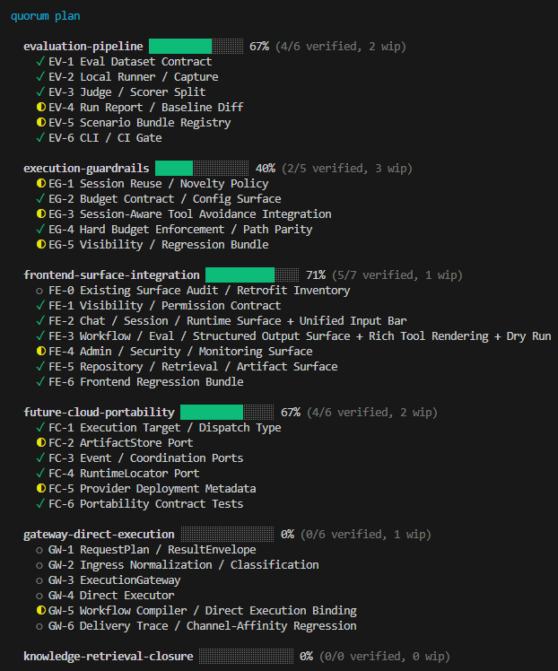

# quorum

[](https://www.npmjs.com/package/quorum-audit)
[](https://github.com/berrzebb/quorum/actions/workflows/ci.yml)
[](https://opensource.org/licenses/MIT)
[](https://nodejs.org)
[](https://www.typescriptlang.org)

Cross-model audit gate with structural enforcement. One model cannot approve its own code.

[한국어](README.ko.md)

```
edit → audit → agree → retro → commit
```

<p align="center">
  
</p>

## What it does

quorum enforces a consensus protocol between AI agents. When code is written, an independent auditor reviews the evidence. If rejected, the author must fix and resubmit. The cycle repeats until consensus is reached — only then can the code be committed.

The key principle: **no single model can both write and approve code.** This is the "quorum" — a minimum number of independent voices required for a decision.

## Installation

### Standalone (any AI tool)

quorum works without any IDE plugin. Just the CLI.

```bash
npm install -g quorum-audit    # global install
# or
npx quorum-audit setup         # one-shot without install

cd your-project
quorum setup                   # creates config + MCP server registration
quorum daemon                  # TUI dashboard
```

Works with **any AI coding tool** — Claude Code, Codex, Cursor, Gemini, or manual use.

### As a Claude Code plugin

For automatic hook integration (event-driven audit on every edit):

```bash
claude plugin marketplace add berrzebb/quorum
claude plugin install quorum@berrzebb-plugins
```

This registers 15 lifecycle hooks, 19 MCP tools, 9 skills, and 12 specialist agents automatically. The CLI still works alongside the plugin.

### As a Gemini CLI extension

For automatic hook integration with Gemini CLI:

```bash
gemini extensions install https://github.com/berrzebb/quorum.git
# or for development:
gemini extensions link adapters/gemini
```

This registers 5 hooks, 8 skills, 4 commands, and 19 MCP tools. Same audit engine as Claude Code.

### From source

```bash
git clone https://github.com/berrzebb/quorum.git
cd quorum && npm install && npm run build
npm link                       # makes 'quorum' available globally
```

## CLI

```
quorum <command>

  setup          Initialize quorum in current project
  interview      Interactive requirement clarification
  daemon         Start TUI dashboard
  status         Show audit gate status
  audit          Trigger manual audit
  plan           Work breakdown planning
  orchestrate    Track orchestration (parallel execution)   # v0.4.0
  ask <provider> Query a provider directly
  tool <name>    Run MCP analysis tool
  migrate        Import consensus-loop data into quorum
  help           Show help
```

## Migrating from consensus-loop

If you were using consensus-loop (v2.5.0), quorum can import your existing data:

```bash
quorum migrate            # import config, audit history, session state
quorum migrate --dry-run  # preview without changes
```

What it migrates:

| Data | From | To |
|------|------|----|
| Config | `.claude/consensus-loop/config.json` | `.claude/quorum/config.json` |
| Audit history | `.claude/audit-history.jsonl` | SQLite EventStore |
| Session state | `.session-state/retro-marker.json` | Preserved (shared location) |
| Watch/respond files | `docs/feedback/claude.md` | No change needed |
| MCP server | `.mcp.json` consensus-loop entry | Cloned as quorum entry |

Your existing watch file and evidence are preserved — quorum reads the same files.

## How it works

### Without a plugin (standalone)

```
you write code
    → quorum audit              # trigger manually
    → auditor reviews           # Codex, GPT, Claude, or any provider
    → quorum status             # check verdict
    → fix if rejected           # resubmit
    → quorum daemon             # watch the cycle in real-time TUI
```

### With Claude Code plugin (automatic)

```
you write code
    → PostToolUse hook fires    # automatic
    → regex scan + AST refine   # hybrid: false positive removal
    → fitness score computed    # 5-component quality metric
    → fitness gate              # auto-reject / self-correct / proceed
    → trigger eval (10 factors)# skip, simple, or deliberative
    → auditor runs              # background, debounced
    → verdict syncs             # tag promotion/demotion
    → session-gate              # blocks until retro complete
    → commit allowed
```

Both paths use the same core engine: `bus/` + `providers/` + `core/`.

## Architecture

```
quorum/
├── cli/              ← unified entry point (works without any plugin)
├── daemon/           ← Ink TUI dashboard + FitnessPanel (works standalone)
├── bus/              ← EventStore (SQLite) + pub/sub + stagnation + LockService + Fitness + Claims + Orchestrator
├── providers/        ← consensus protocol + trigger (10-factor) + router + domain specialists + AST analyzer
├── core/             ← audit protocol (7 modules), templates, 19 MCP tools
├── languages/        ← pluggable language specs (fragment-based: spec.mjs + spec.{domain}.mjs)
├── agents/knowledge/ ← shared agent protocols (cross-adapter: implementer, scout, 9 specialist domains)
└── adapters/
    ├── shared/       ← adapter-agnostic business logic (8 modules)
    ├── claude-code/  ← Claude Code hooks (15) + agents (12) + skills (9)
    └── gemini/       ← Gemini CLI hooks (5) + skills (8) + commands (4)
```

The `adapters/` layer is **optional**. Everything above it runs independently. Adding a new adapter requires only I/O wrappers — business logic is in `adapters/shared/`.

## Core Concepts

### Enforcement Gates

Three gates that block progress until conditions are met:

| Gate | Blocks when | Releases when |
|------|------------|---------------|
| **Audit** | Evidence submitted | Auditor approves |
| **Retro** | Audit approved | Retrospective complete |
| **Quality** | Lint/test fails | All checks pass |

### Deliberative Consensus

For complex changes (T3), a 3-role protocol runs:

1. **Advocate**: finds merit in the submission
2. **Devil's Advocate**: challenges assumptions, checks root cause vs symptom
3. **Judge**: weighs both opinions, delivers final verdict

### Language Spec Fragments (v0.4.1)

Quality patterns are defined per language in pluggable fragment files:

```
languages/typescript/
  spec.mjs            ← core: id, name, extensions (3 lines)
  spec.symbols.mjs    ← symbol extraction patterns
  spec.imports.mjs    ← dependency parsing
  spec.perf.mjs       ← performance anti-patterns
  spec.a11y.mjs       ← accessibility patterns
  spec.observability.mjs
  spec.compat.mjs
  spec.doc.mjs        ← documentation coverage
```

Adding a new language = `spec.mjs` (3 lines) + relevant fragments. Adding a domain to an existing language = one new fragment file. The registry (`languages/registry.mjs`) auto-discovers and merges fragments at load time.

### Domain Specialists (v0.3.0)

When changes touch specialized domains, quorum conditionally activates expert reviewers:

| Domain | Tool | Agent | Min Tier |
|--------|------|-------|----------|
| Performance | `perf_scan` | perf-analyst | T2 |
| Migration | `compat_check` | compat-reviewer | T2 |
| Accessibility | `a11y_scan` | a11y-auditor | T2 |
| Compliance | `license_scan` | compliance-officer | T2 |
| i18n | `i18n_validate` | — | T2 |
| Infrastructure | `infra_scan` | — | T2 |
| Observability | `observability_check` | — | T3 |
| Documentation | `doc_coverage` | — | T3 |
| Concurrency | — | concurrency-verifier | T3 |

Tools are deterministic (zero cost, always run). Agents are LLM-powered (only at sufficient tier).

### Hybrid Scanning

Pattern scanning uses a 3-layer defense against false positives:

1. **Regex first pass** — fast (<1ms/file), catches candidates
2. **scan-ignore pragma** — `// scan-ignore` suppresses self-referential matches
3. **AST second pass** — precise (<50ms/file), removes comment/string matches, analyzes control flow

The `perf_scan` tool uses hybrid scanning: regex detects `while(true)`, AST verifies if `break`/`return` exists.

**Program mode** (`ts.createProgram()`) enables cross-file analysis: unused export detection and import cycle detection via dependency graph DFS.

### Fitness Score Engine

Inspired by Karpathy's autoresearch: **what is measurable is not asked to the LLM.**

Five components combine into a 0.0–1.0 fitness score:

| Component | Weight | Input |
|-----------|--------|-------|
| Type Safety | 0.25 | `as any` count per KLOC |
| Test Coverage | 0.25 | Line + branch coverage |
| Pattern Scan | 0.20 | HIGH-severity findings |
| Build Health | 0.15 | tsc + eslint pass rate |
| Complexity | 0.15 | Avg cyclomatic complexity |

The **FitnessLoop** gates LLM audit with 3 decisions:
- **auto-reject**: score drop >0.15 or absolute <0.3 → skip LLM audit (cost savings)
- **self-correct**: mild drop (0.05–0.15) → warn agent, continue
- **proceed**: stable/improved → update baseline, continue to audit

### Conditional Trigger

Not every change needs full consensus. A 10-factor scoring system (6 base + domain + plan + fitness + blast radius) determines the audit level:

| Tier | Score | Mode |
|------|-------|------|
| T1 | < 0.3 | Skip (micro change) |
| T2 | 0.3–0.7 | Simple (single auditor) |
| T3 | > 0.7 | Deliberative (3-role) |

### Stagnation Detection

If the audit loop cycles without progress, 5 patterns are detected:

- **Spinning**: same verdict 3+ times
- **Oscillation**: approve → reject → approve → reject
- **No drift**: identical rejection codes repeating
- **Diminishing returns**: improvement rate declining
- **Fitness plateau**: fitness score slope ≈ 0 over last N evaluations

### Blast Radius Analysis (v0.4.0)

BFS on the reverse import graph computes transitive dependents of changed files:

```bash
quorum tool blast_radius --changed_files '["core/bridge.mjs"]'
# → 12/95 files affected (12.6%) — depth-sorted impact list
```

- **10th trigger factor**: ratio > 10% → score += up to 0.15 (auto-escalation to T3)
- **Pre-verify evidence**: blast radius section included in auditor evidence
- Reuses `buildRawGraph()` extracted from `dependency_graph` (TTL-cached)

### Structured Orchestration (v0.4.0)

Multi-agent coordination for parallel worktree execution:

| Component | Purpose |
|-----------|---------|
| **ClaimService** | Per-file ownership (`INSERT...ON CONFLICT`), TTL-based expiry |
| **ParallelPlanner** | Graph coloring for conflict-free execution groups |
| **OrchestratorMode** | Auto-selects: serial / parallel / fan-out / pipeline / hybrid |
| **Auto-learning** | Detects repeat rejection patterns (3+), suggests CLAUDE.md rules |

### Event Reactor (v0.4.0)

`respond.mjs` rewritten as a pure event reactor: reads SQLite verdict events → executes side-effects only. No markdown read/write. `-1043/+211 lines` refactoring.

### Dynamic Escalation

The tier router tracks failure history per task:

- 2 consecutive failures → escalate to higher tier
- 2 consecutive successes → downgrade back
- Frontier failures → stagnation signal

### Planner Documents

The planner skill produces 10 document types for structured project planning:

| Document | Level | Purpose |
|----------|-------|---------|
| **PRD** | Project | Product requirements — problem, goals, features, acceptance criteria |
| **Execution Order** | Project | Track dependency graph — which tracks to execute first |
| **Work Catalog** | Project | All tasks across all tracks with status and priority |
| **ADR** | Project | Architecture Decision Records — why, not just what |
| **Track README** | Track | Track scope, goals, success criteria, constraints |
| **Work Breakdown** | Track | Task decomposition — `### [task-id]` blocks with depends_on/blocks |
| **API Contract** | Track | Endpoint specs, request/response schemas, auth |
| **Test Strategy** | Track | Test plan — unit/integration/e2e scope, coverage targets |
| **UI Spec** | Track | Component hierarchy, states, interactions |
| **Data Model** | Track | Entity relationships, schemas, migrations |

## Providers

quorum is provider-agnostic. Bring your own auditor.

| Provider | Mechanism | Plugin needed? |
|----------|-----------|---------------|
| Claude Code | 15 native hooks | Optional (auto-triggers) |
| Gemini CLI | 5 hooks + 8 skills | Optional (`gemini extensions install`) |
| Codex | File watch + state polling | No |
| Cursor | — | Planned |
| Manual | `quorum audit` | No |

## Tools & Verification

Deterministic tools that replace LLM judgment with facts. No hallucination possible.

**Analysis tools** (19):
```bash
# Core analysis
quorum tool code_map src/              # symbol index
quorum tool dependency_graph .          # import DAG, cycles
quorum tool blast_radius --changed_files '["src/api.ts"]'  # transitive impact (v0.4.0)
quorum tool audit_scan src/             # type-safety, hardcoded patterns
quorum tool coverage_map                # per-file test coverage
quorum tool audit_history --summary     # verdict patterns
quorum tool ai_guide                    # context-aware onboarding (v0.4.0)

# RTM & verification
quorum tool rtm_parse docs/rtm.md      # parse RTM → structured rows
quorum tool rtm_merge --base a --updates '["b"]'  # merge worktree RTMs
quorum tool fvm_generate /project       # FE×API×BE access matrix
quorum tool fvm_validate --fvm_path x --base_url http://localhost:3000 --credentials '{}'

# Domain specialists (v0.3.0)
quorum tool perf_scan src/             # performance anti-patterns (hybrid: regex+AST)
quorum tool compat_check src/          # API breaking changes
quorum tool a11y_scan src/             # accessibility (JSX/TSX)
quorum tool license_scan .             # license compliance + PII
quorum tool i18n_validate .            # locale key parity
quorum tool infra_scan .               # Dockerfile/CI security
quorum tool observability_check src/   # empty catch, logging gaps
quorum tool doc_coverage src/          # JSDoc coverage %
```

**Verification pipeline** (`quorum verify`):
```bash
quorum verify              # all checks
quorum verify CQ           # code quality (eslint)
quorum verify SEC          # OWASP security (10 patterns, semgrep if available)
quorum verify LEAK         # secrets in git (gitleaks if available, built-in fallback)
quorum verify DEP          # dependency vulnerabilities (npm audit)
quorum verify SCOPE        # diff vs evidence match
```

Full reference: [docs/en/TOOLS.md](docs/en/TOOLS.md) | [docs/ko/TOOLS.md](docs/ko/TOOLS.md)

## Tests

```bash
npm test                # 812 tests
npm run typecheck       # TypeScript check
npm run build           # compile
```

## CI/CD

GitHub Actions builds cross-platform binaries on tag push:

```bash
git tag v0.4.1
git push origin v0.4.1
# → linux-x64, darwin-x64, darwin-arm64, win-x64 binaries in Releases
```

## License

MIT
