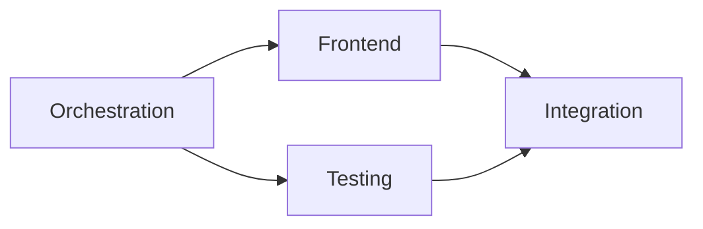

# Execution Order Guide

## Purpose

The execution order defines the **sequence and dependency graph** between tracks. It answers: "What can start now? What's blocked? What unblocks what?"

## Location

`{planning_dir}/execution-order.md` — one file per project.

## Structure

```markdown
# Execution Order

## Track Dependency Graph



## Execution Sequence

| Phase | Track | Prerequisites | Entry Condition | Exit Condition |
|-------|-------|--------------|-----------------|----------------|
| 1 | OR — Orchestration | — | PRD FR-1~FR-5 approved | All WBs verified in RTM |
| 2 | FE — Frontend | OR | OR API contracts finalized | All WBs verified, FVM pass |
| 2 | TR — Testing | OR | OR composition root stable | Coverage targets met |
| 3 | INT — Integration | FE, TR | Both FE and TR exit conditions met | E2E suite passes |

## Parallel Execution Groups

Tracks in the same phase can run in parallel:
- **Phase 2**: FE and TR are independent — can be assigned to separate implementer agents

## Current Status

| Track | Status | Progress | Blocker |
|-------|--------|----------|---------|
| OR | in-progress | 3/5 WBs done | — |
| FE | blocked | 0/4 WBs done | Waiting for OR API contract |
| TR | ready | 0/3 WBs done | — |
```

## Writing Principles

1. **Entry and exit conditions are verifiable** — "OR is done" is not an entry condition. "OR API contracts finalized and published in api-contract.md" is.
2. **Parallel where possible** — Don't serialize tracks that have no dependency. Mark parallel groups explicitly.
3. **Current status is always updated** — When a track status changes, update this document. Stale execution orders cause wasted work.
4. **Blockers are actionable** — "Blocked" without a reason is useless. State what unblocks it.
