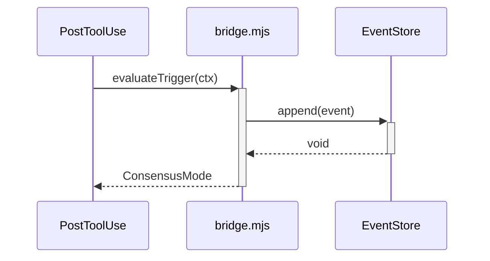
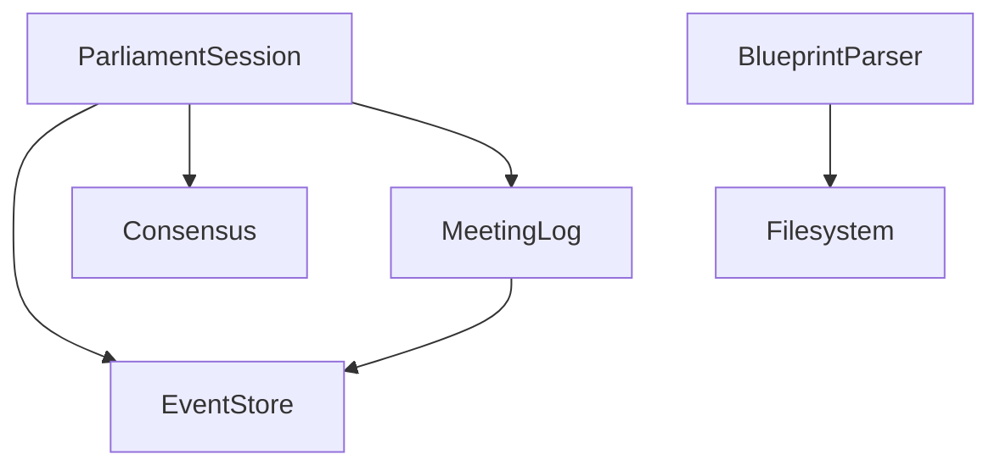
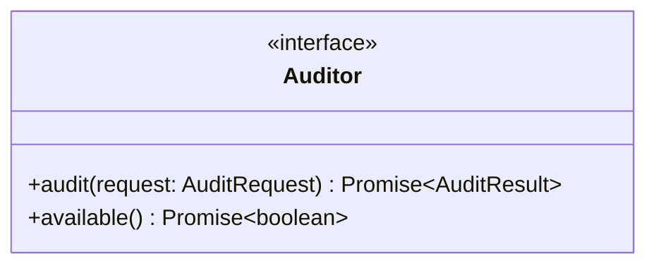
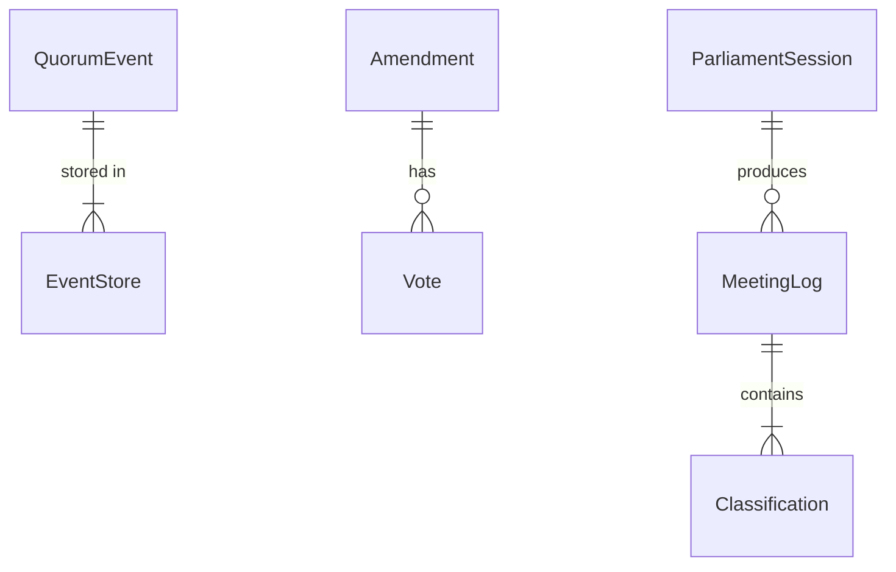
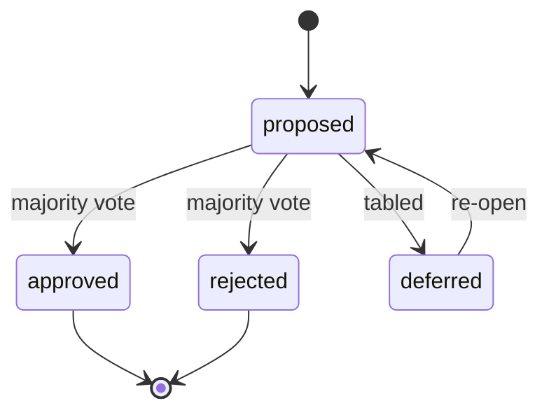

# Design Phase Guide

## Purpose

After PRD confirmation and before Work Breakdown generation, produce 4 design artifacts that define **how** to build what the PRD specifies. These artifacts establish the "laws" that implementers must follow.

## When to Apply

- **Always** for tracks originating from Parliament CPS (CPS→Design is mandatory in the legislative flow)
- **Always** for new product/feature tracks with 3+ WB items
- **Minimum**: Spec + Architecture for any track with external API surface or persistence
- Design artifacts are **laws** — they remove subjective implementation decisions. Skipping Design breaks the idempotency guarantee (`impl(A, law) = impl(B, law)`).

## Location

`{planning_dir}/{track-name}/design/` — one directory per track.

## Diagram Requirements

Every design artifact **must** include at least one mermaid diagram of the appropriate type. Read `platform/skills/mermaid/references/{type}.md` for syntax before generating.

| Artifact | Required Diagram | Mermaid Type | Reference |
|----------|-----------------|-------------|-----------|
| Spec | API call flow per FR | `sequence` | sequence.md |
| Blueprint | Module dependency graph | `flowchart` or `classDiagram` | flowchart.md, class.md |
| Domain Model | Entity relationships + State machines | `erDiagram` + `stateDiagram-v2` | er.md, state.md |
| Architecture | System topology | `architecture-beta` or `flowchart` | architecture.md |

Diagrams are not decorative — they are **verifiable contracts**. An implementer reads the sequence diagram to know exact call order; the ER diagram to know exact cardinality.

## 4 Artifacts

### 1. Spec (Technical Specification)

Translates FR/NFR acceptance criteria into technical terms. **Must include sequence diagrams for API flows.**

```markdown
# Technical Spec: {Track Name}

## FR-1: {Title}
- **Input**: EventStore.append(event: QuorumEvent)
- **Output**: void (persisted to SQLite WAL)
- **Validation**: event.type must be valid EventType, payload JSON-serializable
- **Error responses**: throws on closed store, fail-open on WAL contention
- **Performance**: p95 < 5ms per append (WAL mode)

### Call Flow


```

Each FR maps to a concrete input/output/validation/error specification. Each FR with inter-component interaction **must** have a sequence diagram showing the call flow.

### 2. Blueprint (Module & Interface Design)

Defines modules, their interfaces, and contracts between them. **Must include class/dependency diagram.**

```markdown
# Blueprint: {Track Name}

## Module Dependency Diagram



## Module Map
| Module | Responsibility | Exposes | Consumes |
|--------|---------------|---------|----------|
| ParliamentSession | 7-phase session orchestration | runParliamentSession() | EventStore, Consensus, MeetingLog |
| MeetingLog | Accumulation + convergence | createMeetingLog(), checkConvergence() | EventStore |
| BlueprintParser | Naming rule extraction | extractNamingRules(), parseBlueprints() | Filesystem |

## Interface Contracts



| Interface | Method | Signature | Notes |
|-----------|--------|-----------|-------|
| Auditor | audit | (request: AuditRequest) => Promise<AuditResult> | Throws on timeout |
| Auditor | available | () => Promise<boolean> | Never throws |

## Naming Conventions
| Concept | Name | Rationale |
|---------|------|-----------|
| Audit verdict values | `AuditVerdict` | Type alias, not enum — per TypeScript conventions |
| Parliament session runner | `runParliamentSession` | Function, not class — stateless orchestration |
| Event store | `EventStore` | PascalCase class, not eventStore or event_store |
| Meeting classification | `MeetingClassification` | Union type, not enum — "gap" / "strength" / "out" / "buy" / "build" |
```

**The Naming Conventions table is critical** — it removes subjective naming decisions from implementers. Enforced by `quorum tool blueprint_lint`.

### 3. Domain Model

Defines core domain objects and their relationships. **Must include ER diagram + state machine diagrams.**

```markdown
# Domain Model: {Track Name}

## Entity Relationship Diagram



## Entities
| Entity | Key Fields | Relationships |
|--------|-----------|--------------|
| QuorumEvent | id, type, source, payload, timestamp | stored in EventStore |
| Amendment | id, target, change, sponsor, status, votes[] | proposed/voted/resolved via events |
| MeetingLog | id, agendaId, registers, classifications | stored as parliament.session.digest event |

## Value Objects
| Name | Fields | Used By |
|------|--------|---------|
| ConvergenceRegisters | statusChanges, decisions, requirementChanges, risks | ConsensusVerdict, MeetingLog |
| CPS | context, problem, solution, gaps[], builds[] | ParliamentSession, Planner |

## State Machines



| Entity | States | Transitions |
|--------|--------|------------|
| Amendment | proposed → approved/rejected/deferred | Only forward; resolved is terminal |
| ConformanceStage | raw-output → autofix → manual-fix → normal-form | Forward only; regression is detected |
```

### 4. Architecture

Defines system topology and data flow. **Must include mermaid diagrams.**

```markdown
# Architecture: {Track Name}

## System Diagram

Use `/quorum:mermaid` to generate. Read `platform/skills/mermaid/references/architecture.md` for syntax.


For logic flows, use `flowchart`. For state machines, use `stateDiagram-v2`.

## UI Wireframes

**When the track includes UI work, wireframes are mandatory.**
Generate SVG wireframes and save to `{planning_dir}/{track}/wireframes/`.
See `platform/skills/planner/references/ui-spec.md` for SVG template and rules.
No implementation WB may start without a corresponding wireframe.

## Data Flow
| Flow | Source → Target | Protocol | Data |
|------|----------------|----------|------|
| Audit trigger | PostToolUse hook → bridge.mjs | MJS import | TriggerContext |
| Parliament session | CLI/Hook → parliament-session.ts | Direct call | AuditRequest + SessionConfig |
| Event persistence | Any module → EventStore | SQLite WAL | QuorumEvent |
| TUI polling | StateReader → SQLite | Prepared stmt | FullState (1s interval) |

## Infrastructure
| Component | Technology | Justification |
|-----------|-----------|--------------|
| Event store | SQLite WAL | Single-file, concurrent reads, ACID |
| Process mux | tmux/psmux/raw | Cross-platform agent session management |
| TUI | Ink (React for CLI) | Component-based terminal UI |
```

## DRM Integration

Add Design artifacts to the Document Requirement Matrix:

| Document | Condition | Trigger |
|----------|-----------|---------|
| Spec | Always for tracks with API surface | FR mentions endpoint, input, output |
| Blueprint | Always for tracks with 3+ modules | FR spans multiple components |
| Domain Model | When persistence involved | FR mentions entity, state, relationship |
| Architecture | When infrastructure decisions needed | FR mentions service, protocol, deployment |

## Rules

1. **Design before WB** — Work Breakdowns reference Design artifacts, not the reverse
2. **Naming is law** — Blueprint naming conventions are binding for all implementers
3. **Interfaces are contracts** — Changing an interface requires an Amendment (majority vote)
4. **State machines are exhaustive** — Every valid transition must be listed; unlisted = forbidden
5. **Design artifacts are living documents** — Updated via Amendment process when requirements change

## Anti-Patterns

- Do NOT write Design artifacts that repeat PRD — Design adds technical precision
- Do NOT leave naming decisions to implementers — decide in Blueprint
- Do NOT skip Domain Model for data-heavy tracks — it prevents schema confusion
- Do NOT design Architecture without considering NFRs — performance/security constraints drive technology choices
