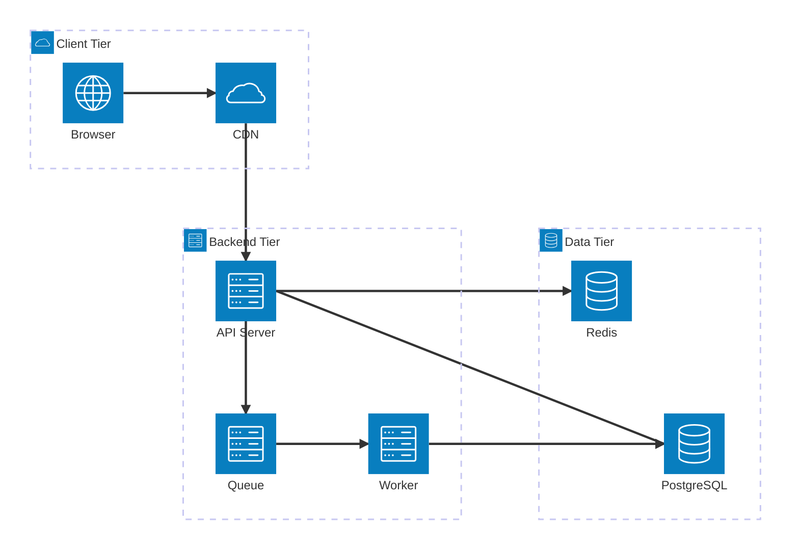

# Architecture Diagram (Beta)

## Start

```
architecture-beta
```

## Groups

```
group <id>(<icon>)[Title]
group <id>(<icon>)[Title] in <parent_id>    %% Nested
```

## Services

```
service <id>(<icon>)[Title]
service <id>(<icon>)[Title] in <group_id>
```

## Edges

```
<id>:<side> --> <side>:<id>      %% Directional
<id>:<side> <-- <side>:<id>      %% Reverse
<id>:<side> --- <side>:<id>      %% Undirected (v11.4.1+)
```

Sides: `T` (top), `B` (bottom), `L` (left), `R` (right)

## Junctions (4-way connectors)

```
junction <id>
junction <id> in <group_id>
```

## Built-in Icons

`cloud`, `database`, `disk`, `internet`, `server`

Custom icons via iconify: `"fa6-solid:gear"`

## Full Example


