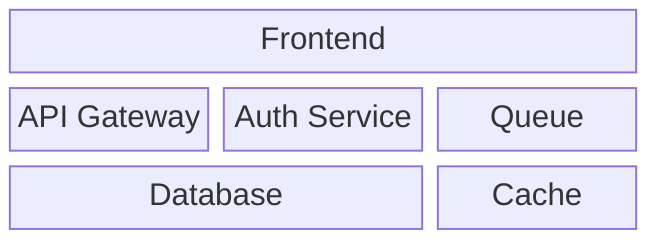
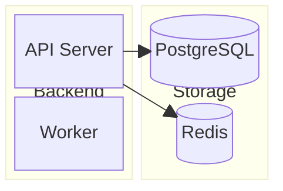

# Block Diagram (Beta)

## Basic



## Columns

```
columns N     %% Set number of columns
```

## Block Width (Column Span)

```
A:3       %% Spans 3 columns
B:2       %% Spans 2 columns
C         %% Spans 1 column (default)
```

## Nested Blocks



## Edges

```
A --> B          %% Directed
A --- B          %% Undirected
A --> B: "label" %% Labeled
```

## Space

```
A space B            %% 1 empty column
A space:3 B          %% 3 empty columns
```

## Block Shapes

Same as flowchart: `[]` rectangle, `(())` circle, `([])` stadium, `[()]` cylinder, `{}` diamond, `{{}}` hexagon, `[//]` parallelogram, `[/\]` trapezoid, `((()))` double circle

## Styling

```
style A fill:#ff9999,stroke:#333,stroke-width:2px
classDef blue fill:#06c,stroke:#000,color:#fff
class A,B blue
```

Key difference from flowchart: block diagrams give full control over spatial positioning.
