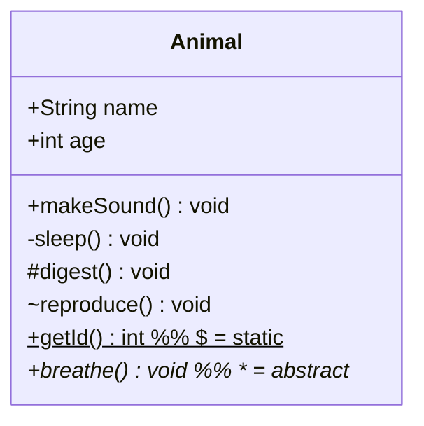
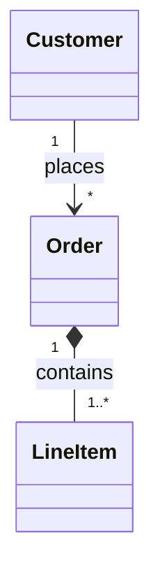
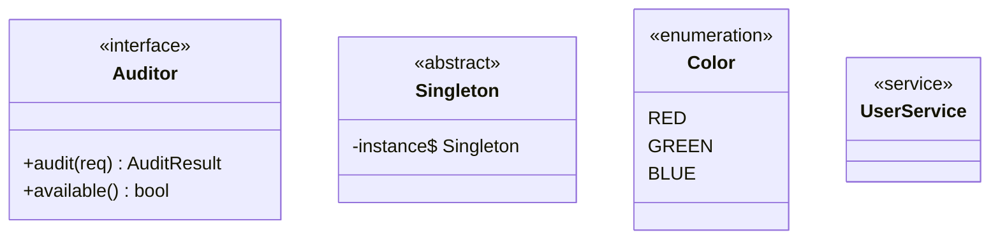
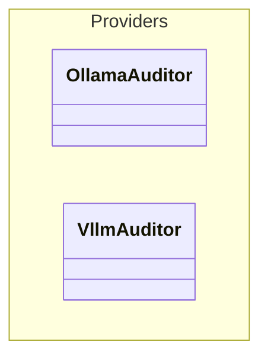

# Class Diagram

## Class Definition



Visibility: `+` public, `-` private, `#` protected, `~` package

## Generics

```
class List~T~ {
  +add(T item) void
  +get(int index) T
}
```

## Relationships

| Syntax | Type | Meaning |
|--------|------|---------|
| `A <\|-- B` | Inheritance | B extends A |
| `A *-- B` | Composition | A owns B (strong) |
| `A o-- B` | Aggregation | A has B (weak) |
| `A --> B` | Association | Directional |
| `A -- B` | Link (solid) | Generic |
| `A ..> B` | Dependency | Uses |
| `A ..\|> B` | Realization | Implements |
| `A .. B` | Link (dashed) | Weak |

### Lollipop Interface

```
bar ()-- foo       %% foo implements bar interface
```

## Cardinality



Options: `1`, `0..1`, `1..*`, `*`, `n`, `0..n`, `1..n`

## Labels

```
A --> B : relationship label
```

## Annotations



## Class Labels

```
class LongClassName ["Display Name"]
```

## Namespaces



## Notes

```
note "Global note"
note for ClassName "Multi-line\nnote text"
```

## Direction

```
direction LR    %% or TB
```

## Styling

```
classDef blue fill:#06c,stroke:#000,color:#fff
class NodeA,NodeB blue
NodeC:::blue
classDef default fill:#f9f,stroke:#333
style NodeD fill:#ff9
```

## Hide Empty Members

```
hideEmptyMembersBox true
```

## Interaction

```
click ClassName href "url" "tooltip"
click ClassName call functionName() "tooltip"
```
