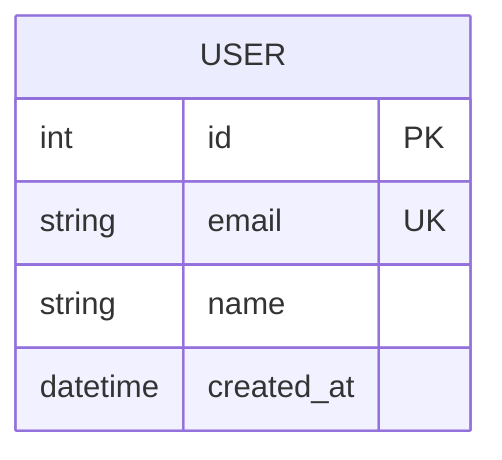
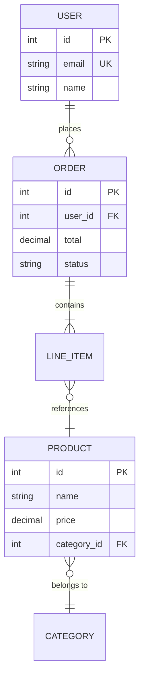

# Entity Relationship Diagram

## Syntax

```
<entity> [<relationship> <entity> : <label>]
```

## Entities with Attributes



Attribute markers: `PK` primary key, `FK` foreign key, `UK` unique key

Multiple keys: `int id PK, FK`

Comments: `string name "User display name"`

## Cardinality (Crow's Foot)

| Left | Right | Meaning |
|------|-------|---------|
| `\|\|` | `\|\|` | Exactly one to exactly one |
| `\|\|` | `o{` | Exactly one to zero or more |
| `\|\|` | `\|{` | Exactly one to one or more |
| `\|o` | `o{` | Zero or one to zero or more |
| `}o` | `o{` | Zero or more to zero or more |

### Aliases

```
||--||    or    one to one
||--o{    or    one to zero or more    or    one to many(0)
||--|{    or    one to one or more     or    one to many(1)
|o--o{    or    zero or one to many(0) or    0+ to 0+
```

## Relationship Lines

```
--    %% Identifying (solid line) — child cannot exist without parent
..    %% Non-identifying (dashed line) — entities exist independently
```

Aliases: `to` (identifying), `optionally to` (non-identifying)

## Full Example



## Entity Aliases

```
CUSTOMER ["Customer"] { ... }
```

## Direction

```
direction LR    %% LR, RL, TB, BT
```

## Styling

```
classDef className fill:#f9f,stroke:#333
class USER className
USER:::className
```

## Layout

```yaml
---
config:
  layout: elk
---
```
