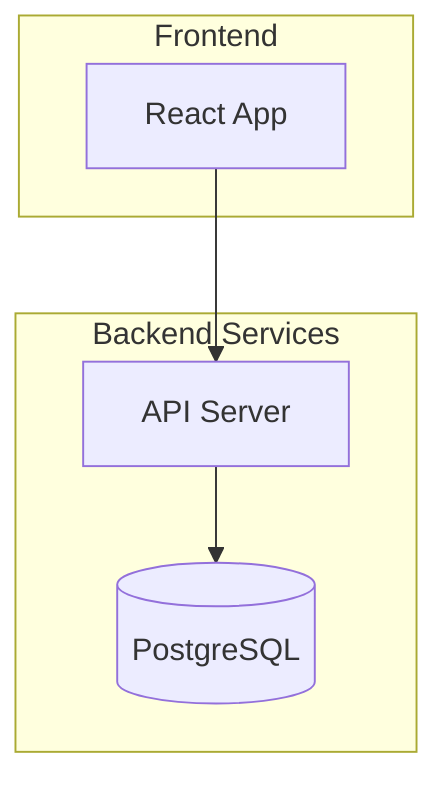

# Flowchart

## Direction

```
flowchart TD    %% Top-Down (same as TB)
flowchart LR    %% Left-Right
flowchart BT    %% Bottom-Top
flowchart RL    %% Right-Left
```

## Node Shapes

```
A[Rectangle]          A(Rounded)            A([Stadium])
A[[Subroutine]]       A[(Cylinder/DB)]      A((Circle))
A>Asymmetric]         A{Diamond}            A{{Hexagon}}
A[/Parallelogram/]    A[\Parallelogram\]    A[/Trapezoid\]
A[\Trapezoid/]        A(((Double Circle)))
```

### Expanded Shapes (v11.3.0+)

```
A@{ shape: cloud }    A@{ shape: doc }      A@{ shape: docs }
A@{ shape: bolt }     A@{ shape: delay }    A@{ shape: flag }
A@{ shape: fork }     A@{ shape: hourglass }
```

### Icon/Image Shapes

```
A@{ icon: "fa:fa-gear", form: "circle", label: "Settings", pos: "t", h: 48 }
A@{ img: "https://example.com/icon.png", label: "Node", pos: "b", w: 60, h: 60 }
```

## Edges

```
A --> B              %% Arrow
A --- B              %% Line (no arrow)
A -.-> B             %% Dotted arrow
A ==> B              %% Thick arrow
A ~~~ B              %% Invisible link
A --o B              %% Circle edge
A --x B              %% Cross edge
A <--> B             %% Bidirectional
A --> |text| B       %% Labeled arrow
A -- "text" --- B    %% Labeled line
B ----> E            %% Extra dashes = longer span
```

### Edge Animations (v11.10.0+)

```
e1@-->{ animate: true }
e1@-->{ animation: "fast" }
e1@-->{ curve: "stepBefore" }
```

Curves: `basis`, `bumpX`, `bumpY`, `cardinal`, `catmullRom`, `linear`, `monotoneX`, `monotoneY`, `natural`, `step`, `stepAfter`, `stepBefore`

## Chaining

```
A --> B --> C
A & B --> C & D      %% Multiple connections
```

## Subgraphs



## Markdown in Nodes

```
A["`**bold** and *italic*`"]
```

## Styling

```
classDef green fill:#2d6,stroke:#1a4,color:#fff
A:::green --> B
style B fill:#f9f,stroke:#333,stroke-width:4px
linkStyle 0 stroke:#ff3,stroke-width:4px
classDef default fill:#f9f,stroke:#333  %% default class
```

## FontAwesome Icons

```
B["fa:fa-twitter for a]
```

## Interaction

```
click A href "https://example.com" _blank
click B call callback() "Tooltip"
```

Requires `securityLevel: 'loose'`.

## Comments

```
%% This is a comment
```

## Config

```yaml
---
config:
  flowchart:
    curve: stepBefore
    defaultRenderer: elk
---
```
