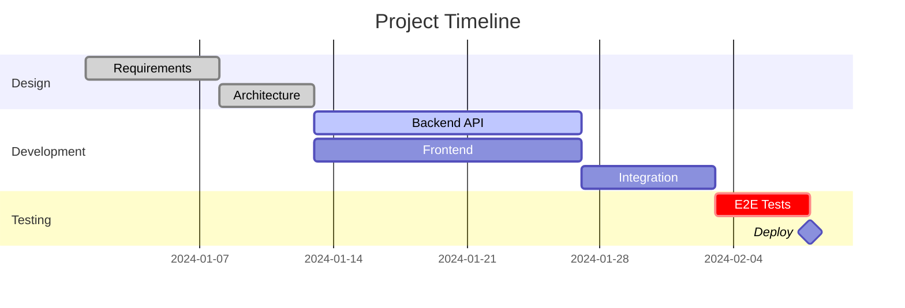

# Gantt Chart

## Basic Structure



## Task Definition

```
Task Name  :state, id, start, end/duration
```

### Start Options

```
2024-01-15         %% Specific date
after taskId       %% After dependency
after taskA, taskB %% After multiple
```

### Duration Options

```
7d       %% Days
2w       %% Weeks
48h      %% Hours
```

## Task States

```
:done,       %% Completed (filled)
:active,     %% In progress (highlighted)
:crit,       %% Critical path (red)
:milestone,  %% Zero-duration diamond
             %% (default) Pending
```

States are combinable: `:crit, active, id, start, duration`

## Date Configuration

```
dateFormat YYYY-MM-DD           %% Input format (moment.js)
axisFormat %Y-%m-%d             %% Display format (d3 time-format)
tickInterval 1week              %% Axis ticks: 1day, 1week, 1month
todayMarker stroke-width:5px,stroke:#0f0   %% Customize
todayMarker off                 %% Hide
```

## Excludes

```
excludes weekends
excludes weekends, 2024-12-25, 2024-12-26
excludes saturday
weekday friday     %% Set week end day
```

## Vertical Markers

```
vert 2024-01-15
```

## Sections

```
section Phase Name
  Task 1 :id1, 2024-01-01, 7d
  Task 2 :id2, after id1, 5d
```

## Comments

```
%% This is a comment
```
