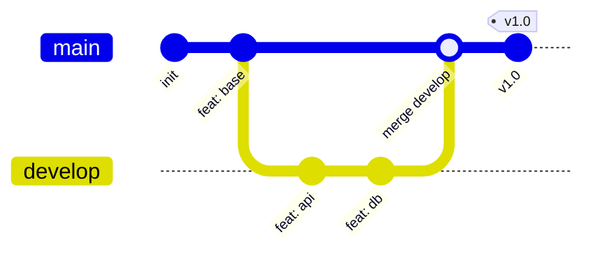

# Git Graph

## Basic



## Commands

| Command | Description |
|---------|-------------|
| `commit` | Register commit on current branch |
| `branch <name>` | Create and switch to new branch |
| `checkout <name>` | Switch to existing branch (alias: `switch`) |
| `merge <name>` | Merge branch into current |
| `cherry-pick id: "<id>"` | Apply commit from another branch |

## Commit Attributes

```
commit id: "abc123"                    %% Custom ID
commit type: HIGHLIGHT                 %% Visual type
commit tag: "v1.0"                     %% Release tag
commit id: "rel" type: HIGHLIGHT tag: "v2.0"  %% All combined
```

### Commit Types

| Type | Visual |
|------|--------|
| `NORMAL` | Solid circle (default) |
| `HIGHLIGHT` | Filled rectangle |
| `REVERSE` | Crossed circle |

## Orientation

```yaml
---
config:
  gitGraph:
    mainBranchName: "main"
---
```

```
LR:    %% Left-to-Right (default)
TB:    %% Top-to-Bottom
BT:    %% Bottom-to-Top
```

Prefix diagram: `gitGraph LR:`

## Branch Order

```yaml
---
config:
  gitGraph:
    mainBranchOrder: 2
---
```

```
branch develop order: 1
branch feature order: 3
```

Lower order = closer to main axis.

## Display Options

| Config | Default | Description |
|--------|---------|-------------|
| `showBranches` | true | Show branch labels |
| `showCommitLabel` | true | Show commit IDs |
| `rotateCommitLabel` | true | 45-degree rotation |
| `parallelCommits` | false | Align commits at same level |
