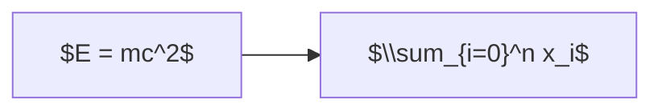
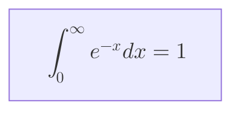

# Math (KaTeX)

## Enable

Requires KaTeX to be loaded. In supported renderers, math is auto-detected.

## Inline Math

Wrap with `$...$` inside labels:



## Block Math

Wrap with `$$...$$`:



## Supported Diagram Types

- Flowchart / Graph
- Sequence Diagram (in messages and notes)
- Class Diagram (in labels)

## Common Expressions

```
$x^2$                    %% Superscript
$x_i$                    %% Subscript
$\\frac{a}{b}$           %% Fraction
$\\sqrt{x}$              %% Square root
$\\sum_{i=0}^n$          %% Summation
$\\int_a^b f(x)dx$       %% Integral
$\\alpha, \\beta, \\gamma$  %% Greek
$\\rightarrow$           %% Arrow
$\\leq, \\geq, \\neq$   %% Comparison
```

## Notes

- Backslashes must be double-escaped in most contexts (`\\`)
- KaTeX must be available in the rendering environment
- Not all mermaid renderers support math (GitHub markdown does not)
