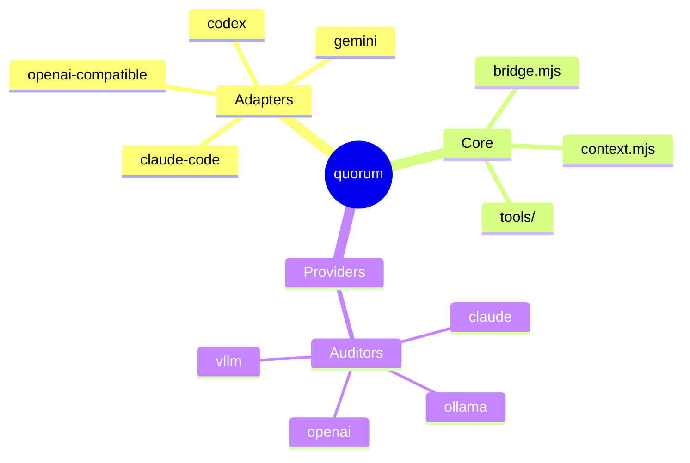

# Mindmap

## Basic (Indentation-Based)



Indentation defines parent-child hierarchy. System compensates for inconsistent indentation by selecting nearest ancestor.

## Node Shapes

```
id[Square]
id(Rounded square)
id((Circle))
id)Bang(
id))Cloud((
id{{Hexagon}}
Default text          %% No delimiter = default shape
```

## Icons

```
mindmap
  Root
    Child::icon(fa fa-book)
```

Font Awesome and Material Design icons supported. Must be registered by site admin.

## CSS Classes

```
mindmap
  Root
    Child:::urgent
```

## Markdown Strings

```
mindmap
  Root
    **Bold text**
    *Italic text*
```

## Layout Configuration

```yaml
---
config:
  layout: tidy-tree
  mindmap:
    maxNodeWidth: 200
    padding: 10
---
```

Configurable: `layoutAlgorithm`, `maxNodeWidth`, `padding`
