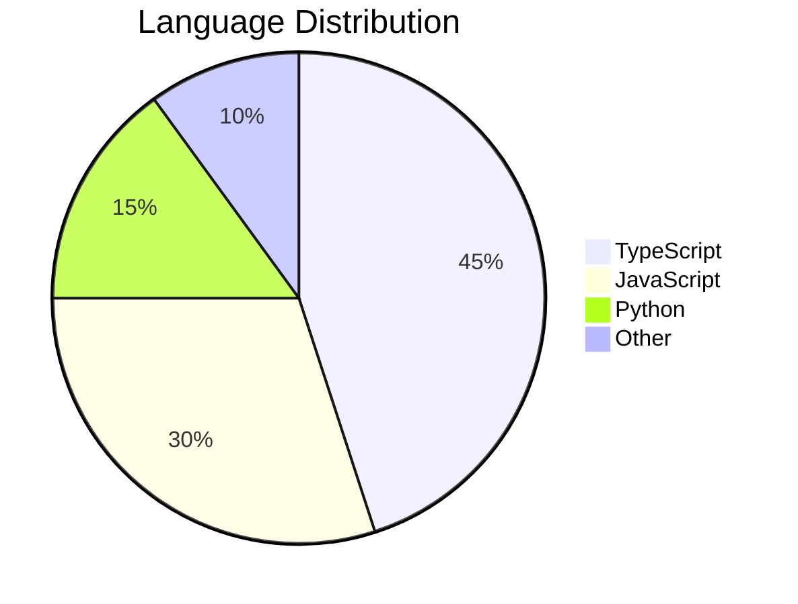
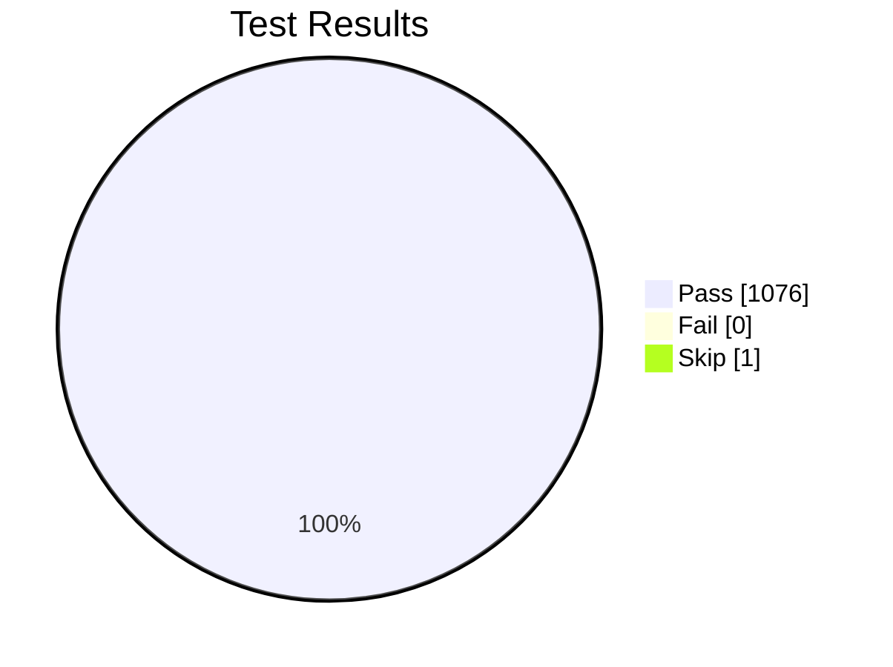

# Pie Chart

## Basic

## showData

Renders actual values after legend text:

## Rules

- Values must be **positive numbers** (> 0). Negative values cause errors.
- Up to two decimal places.
- Labels in double quotes.
- Mermaid auto-calculates percentages from values.

## Configuration

| Parameter | Description | Default |
|-----------|-------------|---------|
| `textPosition` | Label position: 0.0 (center) to 1.0 (edge) | 0.75 |
