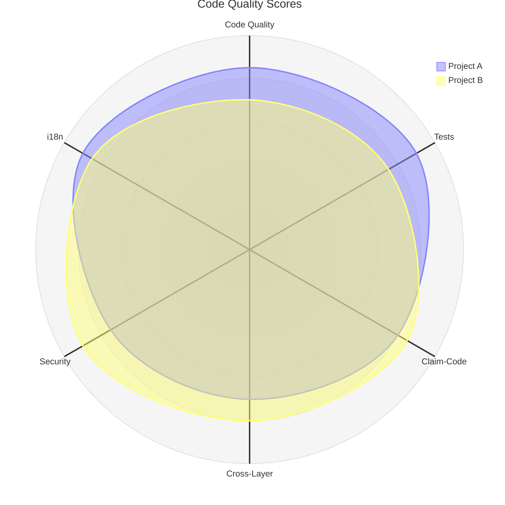

# Radar Chart (Beta)

## Basic



## Syntax

```
radar-beta
  axis <id>["Label"], <id>["Label"], ...    %% Axes (comma-separated, one or multiple lines)
  curve <id>["Label"]{v1, v2, ...}          %% Data series (values match axis order)
  max <number>                               %% Scale maximum
  min <number>                               %% Scale minimum
```

## Rules

- `radar-beta` keyword required (feature is in beta)
- Title via YAML frontmatter: `---\ntitle: "..."\n---`
- Axes rendered clockwise from top
- Each curve must have exactly as many values as total axes
- Multiple `axis` lines allowed — all axes are concatenated
