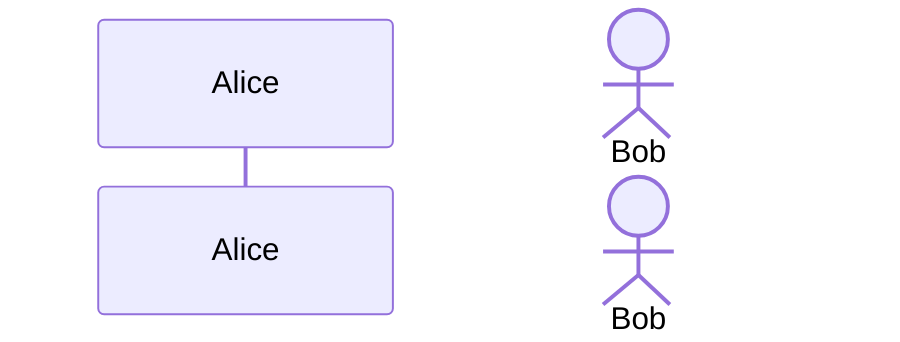
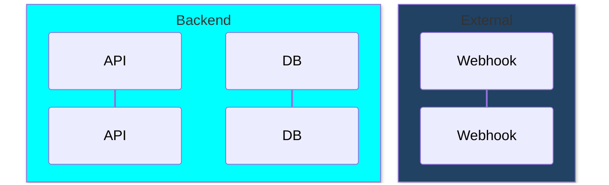
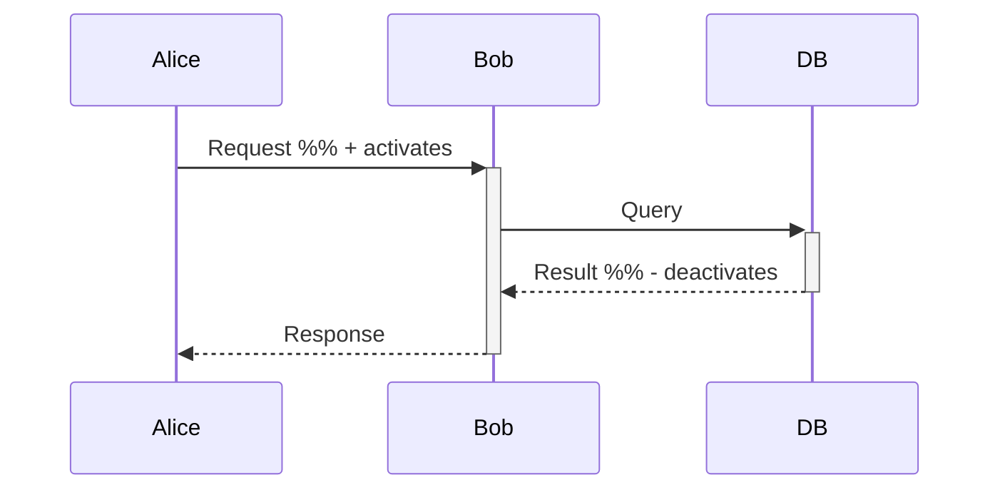
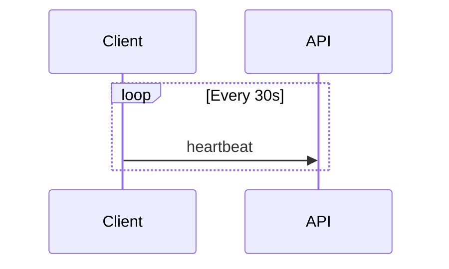
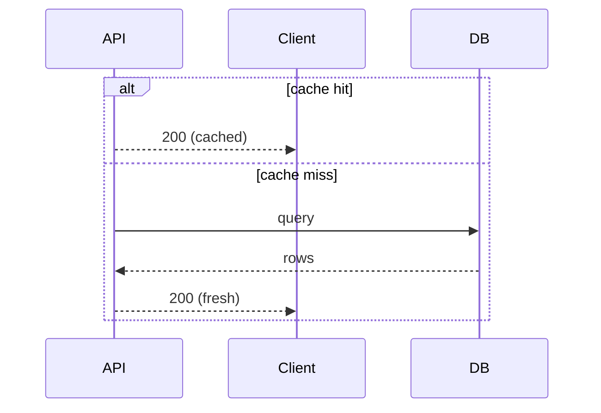
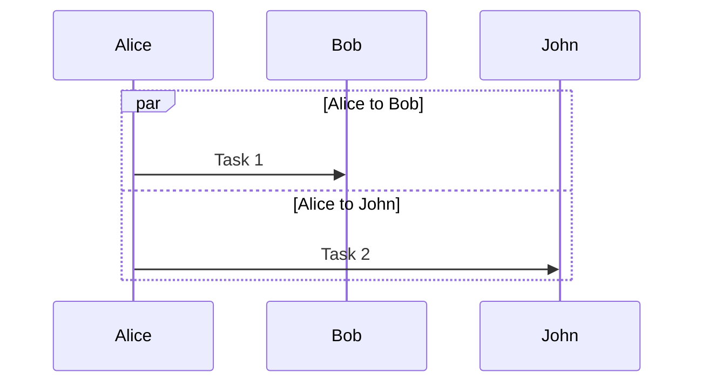
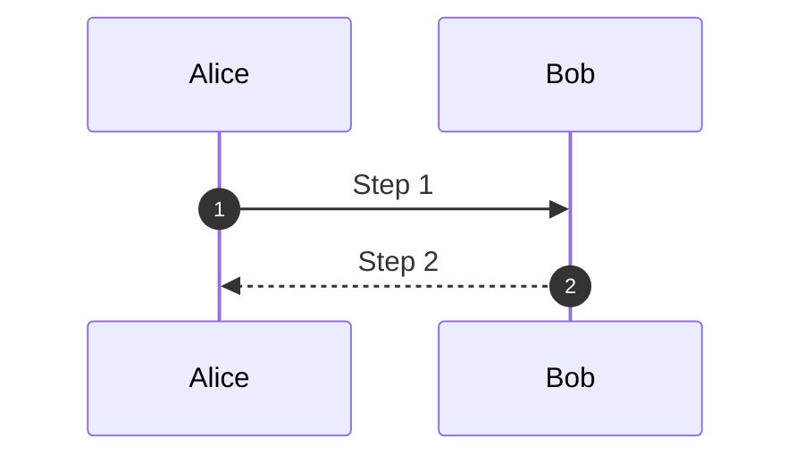
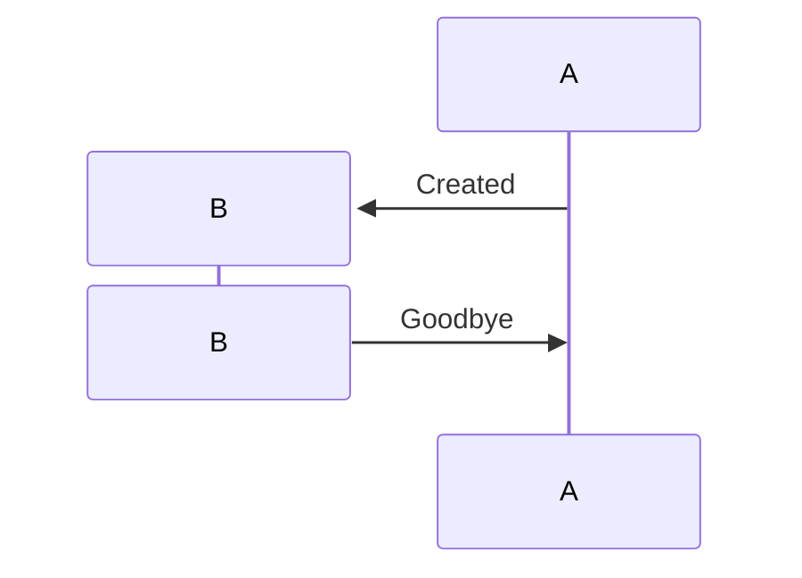

# Sequence Diagram

## Participants & Actors



### Typed Participants

```
participant {"type": "boundary", "label": "API Gateway"}
participant {"type": "database", "label": "PostgreSQL"}
participant {"type": "queue", "label": "Message Queue"}
participant {"type": "entity", "label": "User"}
participant {"type": "control", "label": "Controller"}
participant {"type": "collections", "label": "Cache"}
```

### Grouping (Box)



## Message Arrow Types

```
A ->> B        %% Solid arrow
A -->> B       %% Dotted arrow
A <<->> B      %% Bidirectional (v11.0.0+)
A <<-->> B     %% Dotted bidirectional
A -x B         %% Solid with cross (lost)
A --x B        %% Dotted with cross
A -) B         %% Async open arrow
A --) B        %% Dotted async
```

### Half-Arrows (v11.12.3+)

```
A -|\ B        %% Top half arrowhead
A -|/ B        %% Bottom half arrowhead
```

### Central Connections (v11.12.3+)

```
Alice ->>() communicate: Broadcasting
```

## Activation



## Notes

```
Note right of Alice: Single side
Note left of Bob: Other side
Note over Alice,Bob: Spanning note
```

Line breaks: `Note right of A: Line 1<br/>Line 2`

## Control Flow

### Loop



### Alt / Else



### Opt (if without else)

```
opt has webhook
  API -) Webhook: notify
end
```

### Par (parallel)



### Critical / Option

```
critical Must succeed
  Alice ->> Bob: Critical op
option Timeout
  Alice ->> Bob: Retry
end
```

### Break

```
break Connection lost
  Bob -->> Alice: Error
end
```

### Rect (background highlight)

```
rect rgba(0, 0, 255, .1)
  Alice ->> Bob: Highlighted
end
```

## Autonumber



## Create / Destroy (v10.3.0+)



## Actor Menus (links)

```
link Alice: Dashboard @ https://dashboard.example.com
links Alice: {"Wiki": "https://wiki.example.com"}
```

## Comments

```
%% This is a comment
```
