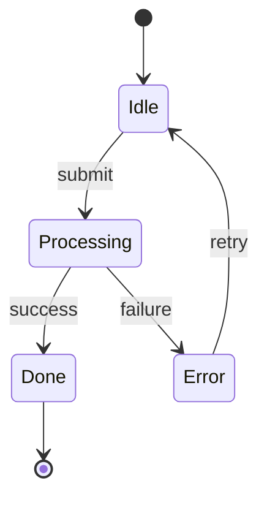
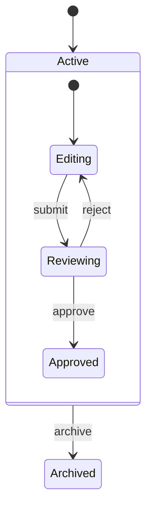
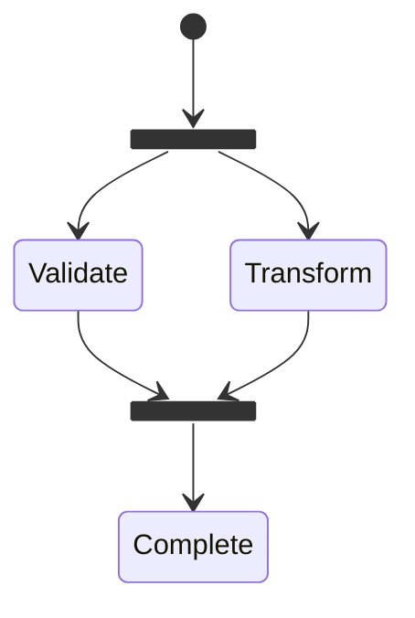
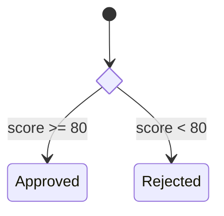
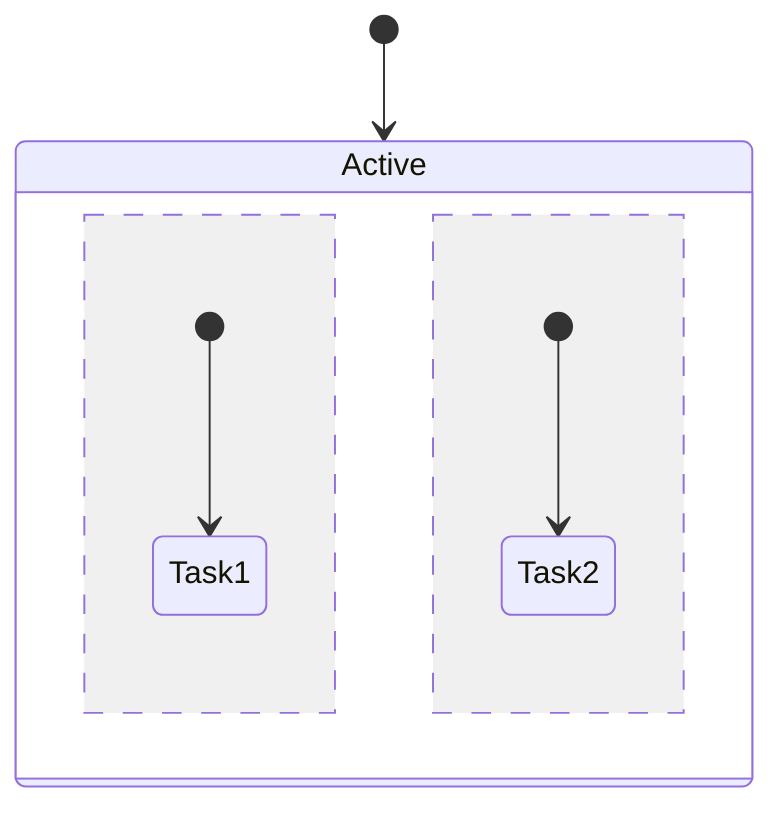

# State Diagram

## Declaration

```
stateDiagram-v2
```

## States

```
s1                           %% Simple ID
state "Description" as s1    %% With keyword
s1: State Description        %% Colon notation
```

## Transitions



`[*]` = start/end state

## Composite States



Multi-layer nesting supported.

## Fork / Join (Parallel)



## Choice



## Concurrency



`--` separates concurrent regions.

## Notes

```
note right of Processing
  Runs async audit pipeline.
  Max 3 correction rounds.
end note
```

## Direction

```
stateDiagram-v2
  direction LR    %% LR, RL, TB, BT
```

## Styling

```
classDef alert fill:#f00,color:#fff,font-weight:bold
class ErrorState alert
StateA:::alert --> StateB
```

## Constraint

Transitions between internal states of different composite states are not allowed.
