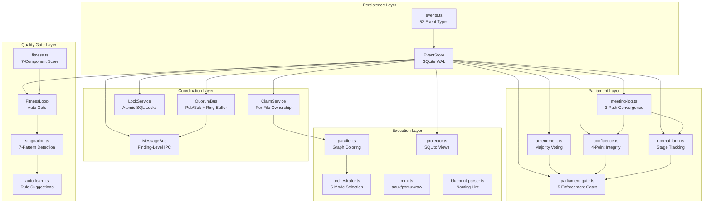

# Bus Module Architecture Analysis

**Project:** quorum
**Date:** 2026-03-27
**Author:** Claude

---

## 1. Executive Summary

The `bus/` directory is the backbone of the quorum project -- a cross-model audit gate system with structural enforcement. It implements a unified, SQLite-backed event-driven architecture that replaces file-based IPC, JSON lock files, and markdown verdict files with a single source of truth. The module contains 17 TypeScript files spanning event storage, concurrency control, quality measurement, parliamentary deliberation, and process orchestration.

The core design principle is: **measurable things are not asked to the LLM**. Deterministic quality gates (fitness scores, stagnation detection, confluence verification) operate mechanically, while LLM audit is reserved for subjective judgment that cannot be automated.

---

## 2. Architecture Overview

The bus/ modules form a layered architecture with three tiers: a persistence layer (EventStore + SQLite), a coordination layer (locks, claims, message bus), and a domain logic layer (fitness, parliament, orchestration).



---

## 3. Module Inventory

| Module | Role | Key Pattern |
|--------|------|-------------|
| **store.ts** | SQLite-backed event storage with WAL mode, UnitOfWork, and TransactionalUnitOfWork | Ouroboros pattern: hooks write, TUI reads, shared DB |
| **bus.ts** | In-process pub/sub with ring buffer, SQLite or JSONL backend | EventEmitter + persistence delegation |
| **events.ts** | 53 event types, typed payloads, factory function | Common protocol: all providers normalize to these types |
| **lock.ts** | Atomic lock acquisition via INSERT...ON CONFLICT | TOCTOU-free, TTL-based expiry, replaces JSON lock files |
| **claim.ts** | Per-file ownership for parallel agents | All-or-nothing atomic claims, same SQL pattern as LockService |
| **message-bus.ts** | Finding-level communication with 3-layer progressive disclosure | Dedup, threading, context revival, agent-to-agent queries |
| **parallel.ts** | Dependency-driven execution groups via graph coloring | Greedy coloring + Kahn's topological sort |
| **orchestrator.ts** | 5-mode auto-selection (serial/parallel/fan-out/pipeline/hybrid) | Conflict density + dependency topology analysis |
| **fitness.ts** | 7-component quality metric (0.0-1.0) | Deterministic: type safety, tests, patterns, build, complexity, security, deps |
| **fitness-loop.ts** | Autonomous quality gate (proceed/self-correct/auto-reject) | Baseline comparison with configurable thresholds |
| **stagnation.ts** | 7-pattern detection for audit loop cycling | spinning, oscillation, no-drift, diminishing-returns, plateau, expansion, divergence |
| **auto-learn.ts** | Repeat pattern detection from audit history | 3+ occurrences trigger CLAUDE.md rule suggestions |
| **meeting-log.ts** | Meeting accumulation and 3-path convergence detection | exact / no-new-items / relaxed convergence, CPS generation |
| **amendment.ts** | Legislative change management with majority voting | propose / vote / resolve lifecycle |
| **confluence.ts** | Post-audit 4-point integrity verification | Law-Code, Part-Whole, Intent-Result, Law-Law checks |
| **normal-form.ts** | Convergence tracking: Raw Output to Normal Form | Per-provider stage tracking, regression detection |
| **parliament-gate.ts** | 5 structural enforcement gates that block work | Amendment, Verdict, Confluence, Design, Regression gates |
| **projector.ts** | SQLite to view generation for daemon TUI | Read-only query wrappers for item states and parliament |
| **mux.ts** | Cross-platform process multiplexer | tmux (Unix) / psmux (Windows) / raw fallback |
| **blueprint-parser.ts** | Design phase naming convention extraction and lint | Parses Blueprint markdown tables into enforceable rules |

---

## 4. Core Design Patterns

### 4.1 Unified SQLite State

All state flows through a single SQLite database using WAL (Write-Ahead Logging) mode. This enables concurrent reads from the TUI daemon while hooks write. Five tables hold the entire system state:

- **events** -- Immutable event log (append-only)
- **state_transitions** -- Entity state machines
- **locks** -- Atomic lock acquisition
- **kv_state** -- General-purpose key-value store
- **file_claims** -- Per-file agent ownership

### 4.2 INSERT...ON CONFLICT Pattern

Both LockService and ClaimService use the same atomic SQL pattern to eliminate TOCTOU (Time-of-Check-to-Time-of-Use) race conditions:

```typescript
// LockService: atomic lock acquisition
const stmtUpsert = db.prepare(`
  INSERT INTO locks (lock_name, owner_pid, owner_session, acquired_at, ttl_ms)
  VALUES (?, ?, ?, ?, ?)
  ON CONFLICT(lock_name) DO UPDATE SET
    owner_pid = excluded.owner_pid,
    owner_session = excluded.owner_session,
    acquired_at = excluded.acquired_at,
    ttl_ms = excluded.ttl_ms
  WHERE locks.owner_pid = ?
    OR locks.acquired_at + locks.ttl_ms < ?
`);
```

This single SQL statement atomically checks if the lock is available (held by the same owner or expired) and acquires it. No gap between check and acquire means no race condition.

### 4.3 TransactionalUnitOfWork

The TransactionalUnitOfWork provides atomic multi-table commits with file projection support. The 3-phase commit ensures consistency:

```typescript
// Phase 1: Write temp files (can fail without side effects)
// Phase 2: SQLite transaction -- events + transitions + kv_state (atomic)
// Phase 3: Rename temp files to target (near-atomic)
// Failure: Phase 2 fails -> delete temp files (zero side effects)
//          Phase 3 fails -> SQLite is truth, files self-heal
```

### 4.4 Fail-Open Philosophy

Every enforcement gate follows a fail-open pattern. If an error occurs during gate evaluation, the gate allows passage rather than blocking the system:

```typescript
export function checkAmendmentGate(store: EventStore): GateResult {
  try {
    const pendingCount = getPendingAmendmentCount(store);
    if (pendingCount > 0) {
      return { allowed: false, reason: `${pendingCount} pending amendment(s)` };
    }
    return { allowed: true };
  } catch {
    return { allowed: true }; // Fail-open
  }
}
```

---

## 5. Data Flow

The typical data flow through the bus follows this sequence:

1. **Evidence submission** -- An adapter hook captures file changes and writes an `evidence.write` event via `EventStore.append()`.
2. **Trigger evaluation** -- The 13-factor trigger system scores the change. Low scores skip audit (T1), medium scores run simple audit (T2), high scores trigger deliberative consensus (T3).
3. **Fitness gate** -- `FitnessLoop.evaluate()` computes a 7-component quality score. If the score dropped more than 0.15 from baseline, the change is auto-rejected without consuming LLM tokens.
4. **Audit cycle** -- Events flow through `audit.start` -> `audit.verdict` -> `audit.correction` states, stored as state transitions.
5. **Finding lifecycle** -- `MessageBus.submitFindings()` stores reviewer findings. The main thread polls, author acknowledges, and findings are resolved through the `finding.detect` -> `finding.ack` -> `finding.resolve` lifecycle.
6. **Parliament gates** -- Before merge, `checkAllGates()` evaluates 5 enforcement gates. Any gate failure blocks the operation until the condition is resolved.

---

## 6. Risk Assessment and Recommendations

### Risks

| Risk | Severity | Detail |
|------|----------|--------|
| SQLite single-writer bottleneck | Medium | WAL mode allows concurrent reads but only one writer at a time. High-throughput parallel agent scenarios could contend on writes. |
| TTL-based expiry precision | Low | Lock and claim TTL relies on `Date.now()` comparisons. Clock skew between processes on the same machine is negligible but could matter in distributed setups. |
| Event table growth | Medium | The events table is append-only with no built-in compaction. Long-running projects will accumulate unbounded event history. |
| Cached prepared statement memory | Low | EventStore's `queryCache` and `countCache` grow unbounded per unique filter shape. Unlikely to be large in practice but has no eviction policy. |
| Fail-open gate bypass | Low | All 5 parliament gates return `allowed: true` on error. While this prevents system lockout, it means corrupted state silently bypasses enforcement. |

### Recommendations

1. **Event compaction** -- Implement a periodic compaction strategy (e.g., archive events older than N days to a separate table or file) to prevent unbounded growth of the events table.
2. **Write batching** -- For parallel agent scenarios, consider batching writes through the QuorumBus ring buffer with periodic flush, reducing SQLite write contention.
3. **Cache eviction** -- Add an LRU eviction policy to EventStore's `queryCache` and `countCache` maps, bounded to a reasonable maximum (e.g., 100 entries).
4. **Gate observability** -- Log gate failures (the `catch` branches) to a side-channel so that silent fail-open events can be audited post-hoc.
5. **Claim conflict metrics** -- Add instrumentation to ClaimService to track conflict frequency and average wait time, enabling capacity planning for parallel execution.

---

## 7. Conclusion

The bus/ module is a well-structured event-driven backbone that eliminates file-based IPC in favor of SQLite as a single source of truth. Its layered architecture cleanly separates persistence, coordination, quality measurement, and parliamentary governance. The INSERT...ON CONFLICT pattern for locks and claims is a particularly strong choice for eliminating race conditions. The main areas for future improvement are event compaction for long-lived projects and enhanced observability for the fail-open gate pattern.
