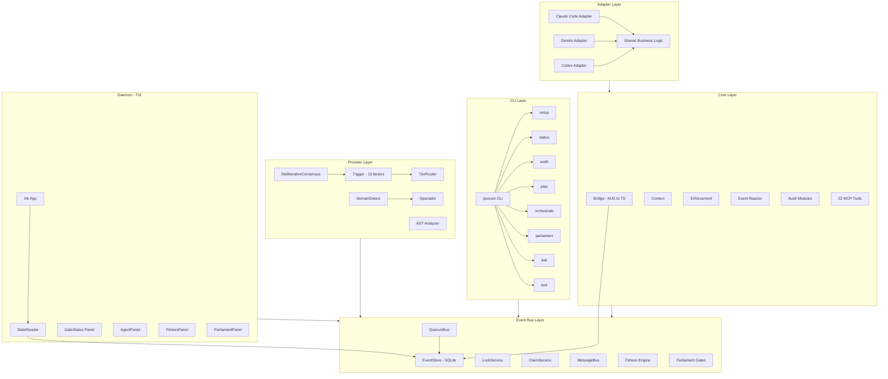
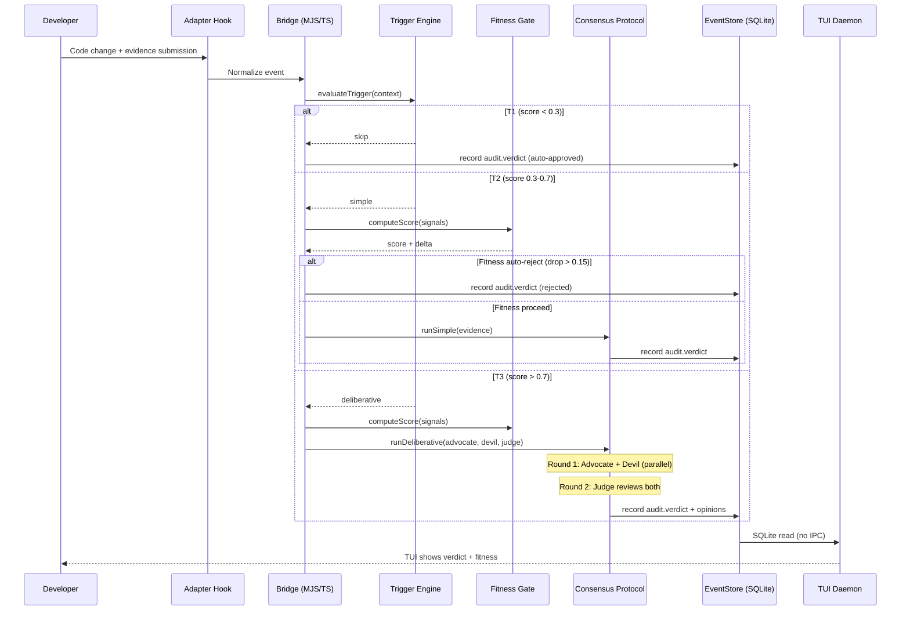

# Quorum Architecture Report

## Project Overview

**Quorum** is a cross-model audit gate with structural enforcement for AI-assisted software development. It implements the pipeline: **Edit → Audit → Agree → Retro → Commit**, ensuring that every code change passes through a multi-model consensus process before being committed.

The core philosophy is that *mistakes should be structurally impossible* — not just discouraged by guidelines, but mechanically blocked by enforcement gates. Quorum achieves this by orchestrating multiple AI models (Claude, Codex, Gemini, Ollama, vLLM) in deliberative consensus protocols, backed by SQLite-based event sourcing and deterministic quality measurement.

**Key Facts:**
- **Version:** 0.4.5 (MIT License)
- **Runtime:** Node.js (ESM), TypeScript compiled to JavaScript
- **State Store:** SQLite (WAL mode) — single source of truth
- **Test Suite:** 1,077 tests across 20+ test files
- **Languages Supported:** TypeScript, Go, Python, Rust, Java
- **Adapters:** Claude Code, Gemini, Codex (3-layer architecture)
- **MCP Tools:** 22 deterministic analysis tools
- **Event Types:** 53 event types covering full lifecycle

---

## High-Level Architecture



---

## Module Breakdown

### CLI (`cli/`)

The CLI is the user-facing entry point, dispatching commands through `cli/index.ts`. Each command maps to a dedicated handler module.

| Command | Module | Purpose |
|---------|--------|---------|
| `setup` | `commands/setup.ts` | Project initialization, MCP server registration |
| `status` | `commands/status.ts` | Gate status display (`--attach`/`--capture` for mux) |
| `audit` | `commands/audit.ts` | Manual audit trigger |
| `plan` | `commands/plan.ts` | Work breakdown listing |
| `orchestrate` | `commands/orchestrate.ts` | Track orchestration with WB parser + mode selection |
| `parliament` | `commands/parliament.ts` | 3-role deliberation (Advocate/Devil/Judge) |
| `ask` | `commands/ask.ts` | Direct provider query |
| `tool` | `commands/tool.ts` | MCP tool invocation |

**CLI Dispatch Pattern:**

```typescript
const COMMANDS: Record<string, {
  description: string;
  handler: () => Promise<void>;
}> = {
  setup: {
    description: "Register MCP server + generate config",
    handler: () => import("./commands/setup.js").then((m) => m.run(args)),
  },
  orchestrate: {
    description: "Select track, distribute to agents, monitor",
    handler: () => import("./commands/orchestrate.js").then((m) => m.run(args)),
  },
  parliament: {
    description: "Parliamentary deliberation (3-role consensus)",
    handler: () => import("./commands/parliament.js").then((m) => m.run(args)),
  },
  // ... more commands
};
```

---

### Event Bus (`bus/`)

The bus layer is the nervous system of quorum — all state flows through SQLite-backed event sourcing with in-process pub/sub.

| Module | Responsibility |
|--------|---------------|
| `bus.ts` | QuorumBus — EventEmitter + SQLite/JSONL persistence |
| `store.ts` | EventStore — SQLite WAL, UnitOfWork, prepared statement caching |
| `lock.ts` | LockService — atomic INSERT...ON CONFLICT locks (TOCTOU-free) |
| `claim.ts` | ClaimService — per-file ownership with TTL expiry |
| `parallel.ts` | ParallelPlanner — graph coloring for conflict-free groups |
| `orchestrator.ts` | OrchestratorMode — 5-mode auto-selection |
| `events.ts` | 53 event type definitions |
| `message-bus.ts` | Finding-level SQLite communication |
| `fitness.ts` | 7-component fitness score engine (0.0-1.0) |
| `fitness-loop.ts` | Autonomous fitness gate (proceed/self-correct/auto-reject) |
| `stagnation.ts` | 7-pattern stagnation detection |
| `meeting-log.ts` | Meeting log accumulation + 3-path convergence |
| `amendment.ts` | Amendment lifecycle (propose/vote/resolve) |
| `confluence.ts` | 4-point post-audit integrity verification |
| `normal-form.ts` | Normal form convergence tracking |
| `parliament-gate.ts` | 5 structural enforcement gates |
| `mux.ts` | ProcessMux (tmux/psmux/raw auto-detection) |
| `auto-learn.ts` | Repeat pattern detection + rule suggestions |

**EventStore — SQLite WAL Pattern:**

```typescript
export class EventStore {
  private db: Database.Database;
  private stmtAppend!: Database.Statement;
  private stmtCurrentState!: Database.Statement;
  private stmtGetKV!: Database.Statement;
  // ... 8 cached prepared statements

  // Schema: events (id, aggregate_type, aggregate_id,
  //         event_type, source, payload, timestamp)
  // Supports: append, replay, query, cursor pagination, UnitOfWork
}
```

**Atomic Lock Acquisition (TOCTOU-free):**

```sql
INSERT INTO locks (lock_name, owner_pid, owner_session, acquired_at, ttl_ms)
VALUES (?, ?, ?, ?, ?)
ON CONFLICT(lock_name) DO UPDATE SET
  owner_pid = excluded.owner_pid,
  owner_session = excluded.owner_session,
  acquired_at = excluded.acquired_at,
  ttl_ms = excluded.ttl_ms
WHERE locks.owner_pid = ? OR locks.acquired_at + locks.ttl_ms < ?
```

---

### Providers (`providers/`)

The provider layer handles AI model integration, consensus protocols, and intelligent routing.

| Module | Responsibility |
|--------|---------------|
| `provider.ts` | QuorumProvider + Auditor interfaces |
| `consensus.ts` | DeliberativeConsensus (3-role + Diverge-Converge) |
| `trigger.ts` | 13-factor conditional trigger (T1/T2/T3 routing) |
| `router.ts` | TierRouter (escalation/downgrade tracking) |
| `ast-analyzer.ts` | TypeScript Compiler API (5 analyzers + cross-file) |
| `agent-loader.ts` | 4-tier persona resolution + LRU cache |
| `domain-detect.ts` | Zero-cost domain detection (10 domains) |
| `domain-router.ts` | Conditional specialist activation (domain x tier) |
| `specialist.ts` | Specialist review orchestrator |
| `claude-code/` | ClaudeCodeProvider (hook-forwarding) |
| `codex/` | CodexProvider (file-watch) + CodexAuditor |

**Consensus Roles and Verdict:**

```typescript
export interface ConsensusVerdict {
  mode: "simple" | "deliberative" | "diverge-converge";
  finalVerdict: "approved" | "changes_requested" | "infra_failure";
  opinions: RoleOpinion[];
  judgeSummary: string;
  duration: number;
  registers?: ConvergenceRegisters;      // diverge-converge only
  classifications?: ClassificationResult[]; // diverge-converge only
}
```

**Trigger Scoring (13 Factors):**

```typescript
export function evaluateTrigger(ctx: TriggerContext): TriggerResult {
  let score = 0;
  // Factor 1: File count         (0-0.3)
  // Factor 2: Security            (0-0.25)
  // Factor 3: Prior rejections    (0-0.2)
  // Factor 4: API surface         (0-0.15)
  // Factor 5: Cross-layer         (0-0.15)
  // Factor 6: Revert              (negative)
  // Factor 7-10: Domain/quality   (variable)
  // Factor 11-12: FDE learning    (variable)
  // Factor 13: Interaction multipliers

  // Score mapping:
  //   0.0 - 0.3 → T1 skip (no audit needed)
  //   0.3 - 0.7 → T2 simple (single auditor)
  //   0.7 - 1.0 → T3 deliberative (3-role protocol)
}
```

---

### Core (`core/`)

The core layer bridges MJS hooks with compiled TypeScript modules, providing fail-safe operation and structural enforcement.

| Module | Responsibility |
|--------|---------------|
| `bridge.mjs` | MJS hooks <-> TS modules bridge (fail-safe) |
| `context.mjs` | Config, paths, parser, i18n |
| `cli-runner.mjs` | Cross-platform spawn utilities |
| `audit.mjs` | Re-export shim for audit modules |
| `audit/` | Split audit pipeline (args, session, scope, pre-verify, codex-runner, solo-verdict) |
| `respond.mjs` | Event Reactor (SQLite verdict -> side-effects only) |
| `enforcement.mjs` | Structural enforcement rules |
| `tools/` | 22 MCP tools |
| `tools/ast-bridge.mjs` | Fail-safe MJS<->AST bridge |

**Bridge Lazy-Loading Pattern:**

```javascript
async function loadModules() {
  if (_modules) return _modules;
  try {
    const toURL = (p) => pathToFileURL(p).href;
    const [storeMod, eventsMod, triggerMod, routerMod,
           stagnationMod, lockMod, messageBusMod,
           fitnessMod, fitnessLoopMod, claimMod,
           parallelMod, orchestratorMod, autoLearnMod,
           parliamentGateMod] = await Promise.all([
      import(toURL(resolve(DIST, "bus", "store.js"))),
      import(toURL(resolve(DIST, "bus", "events.js"))),
      // ... 14 parallel imports
    ]);
    _modules = { storeMod, eventsMod, triggerMod, ... };
    return _modules;
  } catch {
    return null; // Fail-safe: hooks continue in legacy mode
  }
}
```

---

### Languages (`languages/`)

Fragment-based language specifications with auto-discovery.

| Language | Fragments |
|----------|-----------|
| TypeScript | `spec.mjs` + symbols, imports, perf, a11y, compat, observability, doc |
| Go | `spec.mjs` + 7 fragments |
| Python | `spec.mjs` + 7 fragments |
| Rust | `spec.mjs` + 7 fragments |
| Java | `spec.mjs` + 7 fragments |

**Registry enforces `CORE_FIELDS` whitelist**: `spec.mjs` contains metadata only. Domain data (symbols, imports, qualityRules) MUST reside in `spec.{domain}.mjs` fragments. No inline fallback allowed.

---

### Adapters (`adapters/`)

Three adapters follow the 3-layer architecture pattern:

```
I/O Layer (adapter-specific stdin/stdout)
  └→ Business Logic (adapters/shared/ — 17 modules)
       └→ Bridge (core/)
```

| Adapter | Hooks | Skills | Agents |
|---------|-------|--------|--------|
| Claude Code | 22 hooks | 14 skills | 13 agents |
| Gemini | 11 hooks | 14 skills | - |
| Codex | 5 hooks | 14 skills | - |

New adapter = I/O wrappers only (~650 lines vs ~2,000 for full implementation).

---

### Daemon (`daemon/`)

The TUI dashboard built with Ink (React for terminal), providing real-time observability.

| Component | Shows |
|-----------|-------|
| `GateStatus` | Current enforcement gate states |
| `AgentPanel` | Active agent processes |
| `FitnessPanel` | Quality scores over time |
| `ParliamentPanel` | Live mux sessions, convergence, amendments |
| `AuditStream` | Real-time audit event feed |
| `TrackProgress` | Wave execution progress |

---

## Quality Metrics

| Metric | Value | Description |
|--------|-------|-------------|
| Test Count | 1,077 | `node --test tests/*.test.mjs` |
| Test Files | 20+ | Covering all major subsystems |
| Event Types | 53 | Full lifecycle coverage |
| MCP Tools | 22 | Deterministic analysis tools |
| Domains | 11 | perf, a11y, security, migration, etc. |
| Adapters | 3 | Claude Code, Gemini, Codex |
| Languages | 5 | TypeScript, Go, Python, Rust, Java |
| Enforcement Gates | 5 | Amendment, Verdict, Confluence, Design, Regression |
| Fitness Components | 7 | typeSafety, testCoverage, patternScan, buildHealth, complexity, security, dependencies |
| Trigger Factors | 13 | 12 base + interaction multipliers |
| Consensus Roles | 3 | Advocate, Devil's Advocate, Judge |
| Standing Committees | 6 | Principles, Definitions, Structure, Architecture, Scope, Research Questions |

---

## Audit Flow



---

## Key Design Patterns

### 1. Fail-Open Safety

All hooks pass through on error. The system never locks out a developer due to infrastructure failure.

```javascript
// bridge.mjs — every function follows this pattern
try {
  const modules = await loadModules();
  if (!modules) return null; // graceful degradation
  // ... business logic
} catch {
  return null; // fail-open: hook continues
}
```

### 2. SQLite as Single Source of Truth

No verdict files (verdict.md/gpt.md eliminated). All state lives in SQLite tables:

| Table | Purpose |
|-------|---------|
| `events` | Full event log (53 types) |
| `state_transitions` | Entity state machine |
| `locks` | Atomic lock management |
| `kv_state` | Key-value store for config/session state |

### 3. Parliament Protocol

Legislative-style governance for design decisions:

1. **Diverge Phase** — All reviewers speak freely (no role constraints)
2. **Converge Phase** — Judge consolidates into 4 MECE registers: statusChanges, decisions, requirementChanges, risks
3. **Classification** — 5-way analysis: gap, strength, out, buy, build
4. **CPS Generation** — Context-Problem-Solution persisted as events
5. **Amendment Voting** — Majority voting (>50% of eligible), implementer has testimony but no vote

### 4. Wave Execution

Work breakdown items execute in dependency-ordered waves:

1. `computeWaves()` groups WBs by Phase gates (topological sort on `dependsOn`)
2. Each Wave runs up to N agents in parallel (default 3)
3. Wave-level audit after all agents complete
4. On failure: Fixer agent applies targeted fixes, re-audit (max 3 rounds)
5. State persisted to `wave-state-{track}.json` for crash recovery

### 5. Hybrid Scanning

Two-pass analysis combining speed and precision:

- **Pass 1:** Regex pattern scan (fast, broad)
- **Pass 2:** AST analysis via TypeScript Compiler API (precise, targeted)
- `runPatternScan` accepts optional `astRefine` callback
- `perf_scan` is the first hybrid tool

### 6. 3-Layer Adapter Architecture

```
Adapter I/O (~650 lines)
  └→ adapters/shared/ (17 modules — business logic)
       └→ core/ (bridge, context, enforcement)
```

Protocol change in `agents/knowledge/` -> 1 file edit -> all 3 adapters reflect.

---

## Fitness Score Engine

The fitness system provides deterministic quality measurement, independent of LLM opinion.

**Principle: measurable things are not asked to the LLM.**

```typescript
export interface FitnessSignals {
  typeAssertionCount?: number;   // as any / as unknown casts
  effectiveLines?: number;       // Total lines analyzed
  tscExitCode?: number;          // 0 = pass
  tscErrorCount?: number;
  eslintExitCode?: number;
  lineCoverage?: number;         // 0-100
  branchCoverage?: number;       // 0-100
  highFindings?: number;         // HIGH severity scan findings
  totalFindings?: number;
  avgComplexity?: number;        // Cyclomatic complexity
  maxComplexity?: number;
  securityIssues?: number;
  deprecatedDeps?: number;
  totalDeps?: number;
}
```

**Seven Components** (each 0.0-1.0, weighted average):

| Component | Measures |
|-----------|----------|
| typeSafety | `as any` assertions per KLOC, tsc errors |
| testCoverage | Line and branch coverage percentages |
| patternScan | HIGH-severity findings ratio |
| buildHealth | tsc + eslint exit codes |
| complexity | Average and max cyclomatic complexity |
| security | Security issue count |
| dependencies | Deprecated/vulnerable dependency ratio |

**Fitness Gate Logic:**

| Condition | Action |
|-----------|--------|
| Score drop > 0.15 | Auto-reject (no LLM audit) |
| Score drop > 0.05 | Self-correct (retry before audit) |
| Score stable/improved | Proceed to audit |

---

## Parliament Enforcement Gates

Five structural gates that **BLOCK** work when protocol conditions are violated:

```typescript
export interface GateResult {
  allowed: boolean;
  reason?: string;
  details?: Record<string, unknown>;
}
```

| Gate | Blocks When |
|------|-------------|
| **Amendment** | Unresolved amendments exist (must vote first) |
| **Verdict** | Latest audit verdict is not "approved" |
| **Confluence** | Latest confluence check failed (4-point integrity) |
| **Design** | Design artifacts missing before WB generation |
| **Regression** | Normal-form stage has regressed |

`checkAllGates()` runs all 5 gates at once. `quorum merge --force` to bypass.

---

## Normal Form Convergence

The ultimate goal: any implementer converges to the same output regardless of starting point.

**Progression:** Raw Output -> Autofix -> Manual Fix -> Normal Form (100%)

**Conformance formula:**
```
conformance = fitness(40%) + audit_pass_rate(40%) + confluence(20%)
```

Per-provider convergence tracking ensures all AI models converge toward the same structural Normal Form.

---

## Event Protocol

All 53 event types follow a common structure:

```typescript
export interface QuorumEvent {
  type: EventType;
  timestamp: number;
  source: ProviderKind;  // "claude-code" | "codex" | "gemini" | ...
  sessionId?: string;
  trackId?: string;
  agentId?: string;
  payload: Record<string, unknown>;
}
```

**Event Categories:**

| Category | Types | Examples |
|----------|-------|---------|
| Lifecycle | 3 | session.start, session.stop, session.compact |
| Agent | 5 | agent.spawn, agent.progress, agent.complete |
| Audit | 4 | audit.submit, audit.start, audit.verdict, audit.correction |
| Specialist | 3 | specialist.detect, specialist.tool, specialist.review |
| Track | 5 | track.create, track.progress, track.complete |
| Finding | 4 | finding.detect, finding.ack, finding.resolve |
| Quality | 3 | quality.check, quality.pass, quality.fail |
| Fitness | 2 | fitness.compute, fitness.gate |
| Parliament | 5+ | parliament.convergence, parliament.debate.round, parliament.cps.generated |
| Merge | 3 | merge.start, merge.complete, merge.conflict |

---

## Summary

Quorum represents a comprehensive approach to AI-assisted code quality, combining:

- **Multi-model consensus** — No single AI has the final word
- **Structural enforcement** — Mistakes are mechanically blocked, not just flagged
- **Deterministic measurement** — Fitness scores are computed, not opined
- **Event sourcing** — Complete audit trail in SQLite
- **Parliamentary governance** — Design decisions follow legislative process
- **Wave execution** — Dependency-aware parallel implementation with crash recovery
- **Normal form convergence** — All paths lead to the same structural output

The architecture achieves its north star of making structural mistakes impossible through layered enforcement: trigger evaluation gates the audit depth, fitness scores gate the audit entry, consensus gates the verdict, parliament gates the design, and five enforcement gates block non-compliant merges.
