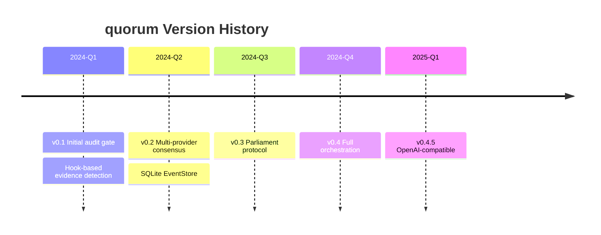
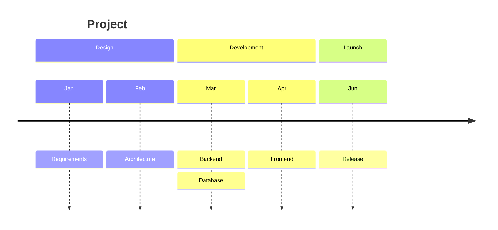

# Timeline

## Basic



## Multiple Events per Period

```
time period : event 1 : event 2 : event 3
```

or

```
time period : event 1
            : event 2
            : event 3
```

## Sections



Each section gets consistent color treatment.

## Text

- Long text wraps automatically
- Force line breaks with `<br>`
- Time labels are free-form (dates, quarters, sprints, etc.)

## Styling

- Default: individual time periods have distinct colors
- `disableMulticolor`: all periods share one scheme
- Theme variables: `cScale0`-`cScale11` (background), `cScaleLabel0`-`cScaleLabel11` (text)
- Themes: `base`, `forest`, `dark`, `default`, `neutral`
